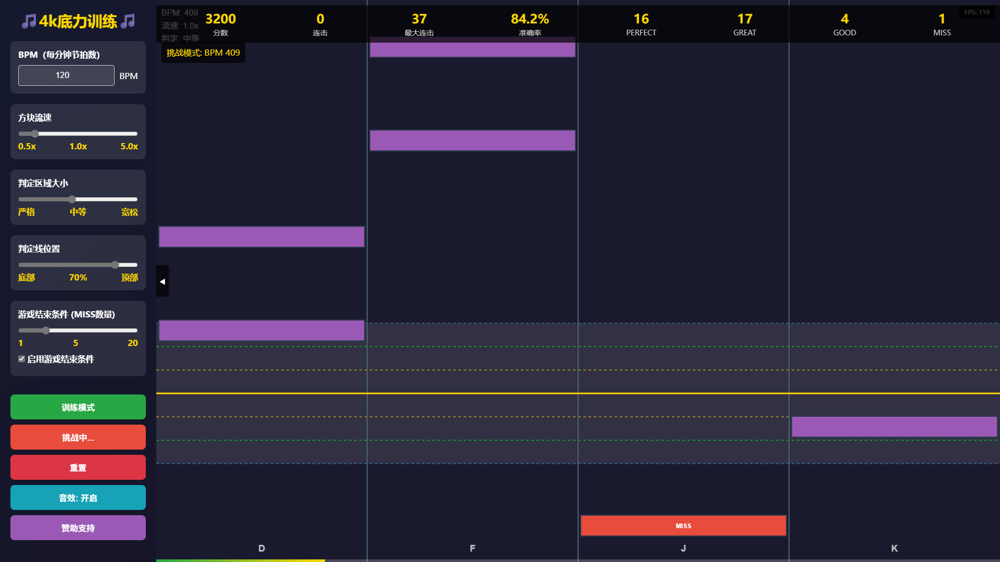

# 🎵 全屏音游底力训练器

> 专为节奏游戏玩家设计的网页版训练工具，帮助提升手速、准确度和反应能力

## ✨ 特色功能

### 🎮 核心训练
- **四键标准布局** - 采用DFJK标准键位，完美适配主流音游
- **可调节BPM** - 支持60-1200 BPM范围，从入门到魔王曲全覆盖
- **多级流速** - 0.5x到5.0x流速调节，适应不同读谱习惯
- **智能判定系统** - PERFECT/GOOD/GREAT/MISS多级判定

### 🛠️ 专业设置
- **10级判定区间** - 从"超严格"到"超宽松"，满足不同水平玩家
- **判定线位置调节** - 20%-80%屏幕位置可调，找到最舒适视角
- **实时数据统计** - 分数、连击、准确率、详细判定分布

### 🎯 训练模式
- **随机音符生成** - 基于BPM的智能音符节奏
- **全屏沉浸体验** - 无干扰的专注训练环境
- **键盘/触屏双支持** - 同时支持电脑和移动设备

## 🚀 快速开始

### 在线体验
访问：[https://你的域名.com](https://你的域名.com)

### 本地运行
1. 下载所有文件到同一文件夹
2. 用浏览器打开 `index.html`
3. 开始训练！

## 🎮 操作指南

### 键盘操作
- **D F J K** - 对应四个轨道的按键
- **空格键** - 开始游戏/暂停游戏
- 无需安装，打开即玩

### 触屏操作
- 直接点击对应轨道区域
- 完美支持手机和平板

## ⚙️ 技术特性

### 前端技术
- 纯HTML5 + CSS3 + JavaScript
- Canvas 2D渲染，60FPS流畅动画
- Web Audio API音效系统
- 响应式设计，多设备适配

### 性能优化
- 硬件加速渲染
- 内存高效管理
- 加载速度快，无需等待

## 🎯 训练建议

### 新手入门
- BPM: 120-160
- 流速: 1.0x-1.5x  
- 判定: 宽松(8级)
- 目标: 建立基本节奏感

### 进阶训练
- BPM: 180-240
- 流速: 2.0x-3.0x
- 判定: 中等(5级)
- 目标: 提升准确度和连击

### 高手挑战  
- BPM: 260-350+
- 流速: 3.5x-5.0x
- 判定: 严格(3级)
- 目标: 稳定AP(全完美)

## 📊 判定标准

| 判定等级 | PERFECT区间 | GREAT区间 | GOOD区间 | 分数 |
|---------|-------------|-----------|----------|------|
| 超严格 | ±15px | ±30px | ±45px | 100/80/60 |
| 宽松 | ±36px | ±72px | ±108px | 100/80/60 |
| 超宽松 | ±42px | ±84px | ±126px | 100/80/60 |

## 🌟 更新日志

### v1.0.0
- ✅ 基础四键音游系统
- ✅ BPM/流速/判定调节
- ✅ 实时数据统计
- ✅ 键盘触屏双支持
- ✅ 全屏沉浸体验

## 💝 赞助支持

### 🐱 来自开发者的喵喵请求

> 喵呜~ 阁下玩得开心吗？如果这个训练器对您的音游底力提升有帮助，可以考虑赞助支持一下喵~
>
> 您的支持将帮助我：
> - 🎵 持续优化游戏性能和体验
> - 🆕 开发更多训练模式和功能  
> - 📱 适配更多设备和平台
> - 🐛 及时修复发现的BUG
>
> **祝您早日达成全连FC，冲击AP全完美！**

### 📱 赞助方式

#### 微信支付

#### 支付宝  

#### 其他支持方式
- ⭐ **给项目点个Star** - 这也是很大的鼓励！
- 📢 **分享给其他音游玩家** - 让更多人受益
- 🐛 **反馈问题和建议** - 帮助改进产品

### 🎁 赞助福利
- 赞助金额 ≥ 10元：您的名字将加入特别感谢名单
- 赞助金额 ≥ 30元：优先体验新功能测试版
- 赞助金额 ≥ 50元：可提出定制化功能建议

## 🤝 特别感谢

感谢所有支持这个项目的玩家们！你们的每一次点击、每一次分享、每一份赞助，都是我们持续改进的动力。

**特别鸣谢名单**：
- [等待您的名字出现在这里]

## 📄 开源协议

MIT License - 欢迎学习和改进！

## 🐛 问题反馈

遇到问题或有建议？欢迎：
1. 提交Issue
2. 发送邮件到：你的邮箱@email.com
3. 通过赞助页面留言

---

**坚持训练，终成大神！祝您游戏愉快！** 🎵

---

*最后更新：2025年11月*
